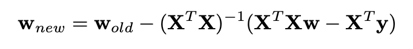
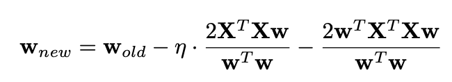
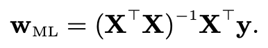

# Least Squares and Maximum Likelihood for Linear Regression
Solving the linear regression problem using various techniques. 

Above image depicts the different results produced from the different techniques. 

Warning: Minimizing the Euclidean Distance(TLS) method can take pretty long.

- ### Ordinary Least Squares 
Minimizing the square differences between values of estimated Y and observed Y. Solved using gradient descent, update rule is as following.



Code accepts a dataset matrix(which can be multidimensional), a targets matrix(only supports single dimensional targets) and returns a vector of weights and a matrix of predicted Y's.
```Python
from LRmodule import errorGradient
regression = errorGradient.ErrorGradient(Dataset,Targets,verbose=[True/False])
weights, predicted_y = regression.run()
```

- ### Minimizing Euclidean Distances | Total Least Squares 
Minimizing the square of Euclidean Distances between the data-points and the hyperplane, a form of Total Least Squares. Solved using gradient descent, update rule is as following.



Code has the same properties as before.
```Python
from LRmodule import euclideanGradient
regression = euclideanGradient.EuclideanGradient(Dataset,Targets,verbose=[True/False])
weights, predicted_y = regression.run()
```

- ### Maximum Likelihood
Forming a closed form solution by calculating maximum likelihood from the log-likelihood of the sum of squared errors. Weights are be calculated according to the formula below.



Code has the same properties as before.
```Python
from LRmodule import wML
regression = wML.WML(Dataset,Targets,verbose=[True/False])
weights, predicted_y = regression.run()
```

- #### Calculating R-Squared
Repository also contains a module to calculate r-squared with.
```Python
from rsquare import r2
r = r2.r2()
value = r.calculate(Predicted_Y, Original_Y)
```

main.py contains demo code which creates regression using sklearn make_regression to test the above programs with. Also compares the r-squared values and plots graphs depicting and comparing the predicted linear equations(Only if using 1 feature).